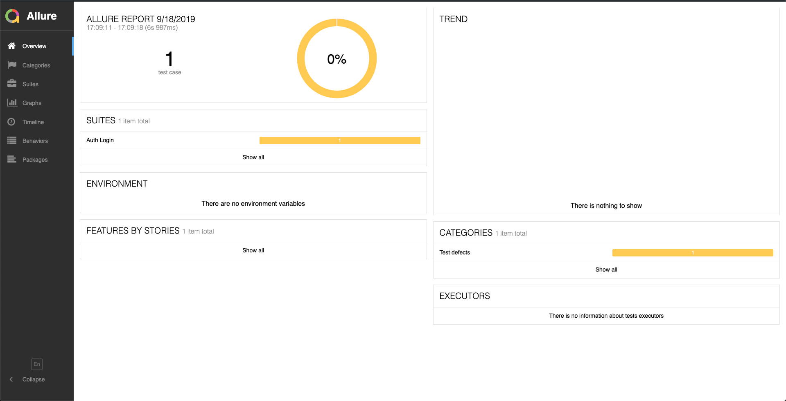

# ui-tests-boilerplate
Boilerplate for adding Cypress test framework to any project.

## Summary
This boilerplate uses Cypress with Cucumber and Docker support for writing integration and end-to-end UI tests. The main focus on how to incorporate it into a continuous integration or continous deployment pipeline.

## Important Notes
### Cypress and Docker
Since Cypress installs its dependecies based on the OS being used; we recommend keeping an eye on the npm packages that are being mounted, as they will likely need reinstalling if you switch between docker OSs. We get around this by installing Cypress during the pipeline execution, with Dockerfile.cypress.

### CI/CD Tools
Currently this is only written for Jenkins. Though we plan to cover CodePipeline AWS. Feel free to include any other pipeline examples.

### IFrames
The Cypress driver had an oversight when it came to interacting with iframes, where it believes they are detached from the DOM. We have included the command in `commands.js`. You will need to call the entire element again to avoid conflicts if you interact with it multiple times.

## Setup
The setup is pretty straightforward:
```bash
git clone https://github.com/healthbridgeltd/ui-tests-boilerplate
Copy the files (excluding the git files) into an existing project. This ensures the tests/features are stored alongside the code.

# We use the --prefix since the package.json is stored within the cypress directory and this allows use to seperate our test runtime from the main project
npm install --prefix ./cypress ./cypress
npm run --prefix ./cypress cypress:open:local
```
Make sure to set the urls of the environments you want Cypress to point at. The json files are stored in the `cypress/config` directory.

```json
{
  "baseUrl": "https://staging.example.com",
  "env": {
    "name": "staging",
    "mocks": false
  }
}
```
## Git Hooks for UI Tests
Run the following command from the root directory of the repository:
```
git config core.hooksPath hooks/
```
This will also you to auto increment the test versions, otherwise you will have to manually update the version every time a test is updated.
## Writing Tests with Cucumber
The first step with writing tests in cucumber is to work out what the feature is you need. Followed by the behaviour that is expected. With Cucumber you write it in Gherkin Script, as shown below:
```gherkin
# example.feature

Scenario: Login
  Given a user is on the "auth" page 
  When they complete the "login" form
  Then their account dasboard should be displayed
```
Ideally we try to keep this high-level so we can reuse it and keep it easy to understand for the business.
Next we need to translate this into steps:
```javascript
// example.steps.js

import { Given, When, Then } from 'cypress-cucumber-preprocessor/steps'
import Auth from '../pages/auth.page'

Given(/^a user is on the "([^"]*)" page$/, (page) => {
  if (page === 'auth') {
    Auth.goTo()
  }
})

When(/^they complete the "([^"]*)" form$/, () =>{
  Auth.completeLogin()
})

Then(/^their account dasboard should be displayed$/, () =>{
  Auth.dashboardIsDisplayed()
})
```
The steps are ideally single (or a small set of) actions, that are either calling the driver directly or calling a page object. We use page objects as we have multiple tests running on each page of the application and it removes a lot of duplication.
```javascript
//example.page.js

const email = '#email'
const password = '#password'
const submit = '[type="submit"]'
const dashboard = '[ui-sref="dashboard"]'

export default class AuthPage {
  static goTo () {
    cy.visit('/auth')
  }

  static completeLogin() {
    cy.get(email).type('someone@somewhere.com')
    cy.get(password).type('password123')
    cy.get(submit).click()
  }

  static dashboardIsDisplayed() {
    cy.get(dashboard).should('be.visible')
  }
}
```
Here we have set up the actual actions that need to carried out by the Cypress driver. While storing our element values as constants. Ideally we can also store the personal information in a JSON or JavaScript object if need be. But for this example we have stuck to the basics.
## Running the Tests
### `test.sh` Commands
```bash
General Commands:
help                prints this message

Testing commands:
build_tests         build the ui-tests docker container
ui_tests [PARAMS]   run ui tests <standalone|local|staging|prod>

```
### NPM Commands
Once the tests have been set up, we can run them with the Cypress UI: 
```bash
npm run --prefix ./cypress cypress:open:{environment}
```
We can also run it using the headless electron browser:
```bash
npm run --prefix ./cypress cypress:test:{environment}
```
## Reporting
We are using the allure cypress plugin for creating our reports since it offers us great support with Jenkins. To generate the report we can simply run:
```bash
npm run cypress:report
```
This will open up a browser similar to this:


## Edge Cases
### No Permissions to run test.sh
If the test.sh file is missing permissions when you try to run it. You might see something like this:
```line 1: ./cypress/test.sh: Permission denied```
Then you need to run `chmod +x ./cypress/test.sh` this will allow the .sh file to be executable.
